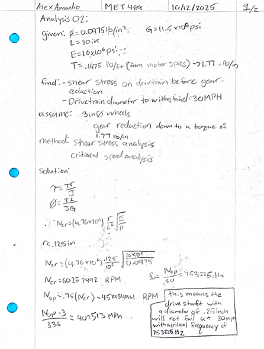
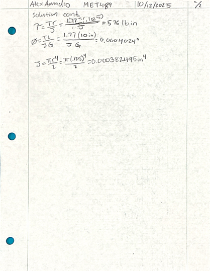
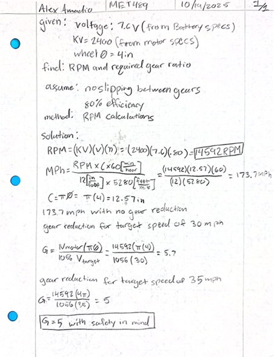

# Analysis

The analysis conducted for this project satisfy design requirements set at the beginning of this project. Some of the analysis confucted can be seen below, these seek to gain an understanding of the torsional shear acting on the driveshaft, the deflection of the chassis due to impacts, and the RPM being transfered to the drive shaft due to the motor. Other analysis include; the deflection of the chassis due to the weight of components, as well as how the gear ratio provides the necessary torque to acheive values set by the requirements.

  <figure style="flex:1 1 45%;margin:0;">
    
    <figcaption>Figure 1: Critical speed and Critical Frequency.</figcaption>
    

      The analysis above describes how much shear is affecting the driveshaft during operation. This analysis also determines the diameter of the draiveshaft to prevent the driveshaft from breaking. As seen, the driveshaft wont break if the diameter is .25 inches or larger. The driveshaft experiences a critical speed of 403523 MPH, this means that the driveshaft wont break at an operational speed of 30 MPH. The critical frequency is observed to be 753225 Hz.
    

  </figure>
  <figure style="flex:1 1 45%;margin:0;">
    
    <figcaption>Figure 3: Torsional Shear and Angle of Twist Cont (2).</figcaption>
    

      The analysis above uses the diameter found to calculate the torsional shear values and the anlge of twist for the driveshaft while under shear from the motor. The Shear value found what 576 lb*in and an angle of twist of 0.0004 degrees. both are less than aluminums elastic yield values.
    

  </figure>

  <figure style="flex:1 1 45%;margin:0;">
    
    <figcaption>Figure 1: Chassis Deflection due to 15 mph impact.</figcaption>
    

      This analysis uses kinetic energy formulas and deflection formulas, to find how much the chassis will deflect during an impact at 15 MPH. as seen the chassis experiences a deflection of .599 inches which is under the requirement of .6 inches. With a max impact force of 1183.74 pounds.
    

  </figure>
  <figure style="flex:1 1 45%;margin:0;">
    
    <figcaption>Figure 3: Motor RPM and Gear ratio.</figcaption>
    

      This analysis was conducted understand what kind of gear ratio is needed to reduce the ROM for the motor down to an RPM that can achieve a max speed of 3 MPH. THis raito is a 5-to-1 gear raito and the RPM that the driveshaft experiences after the reduction is 14592 RPM.
    

  </figure>

