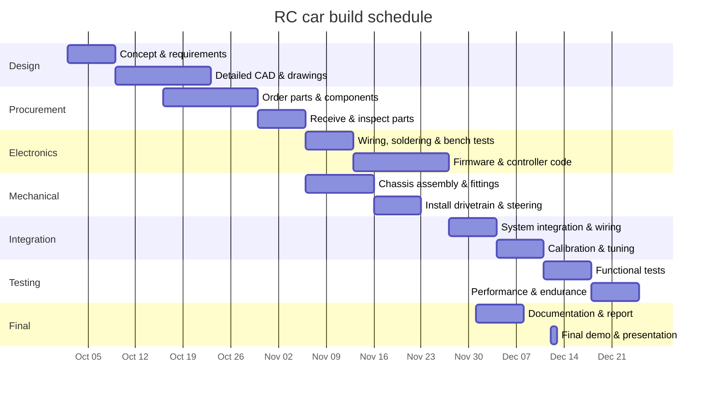

# Budget/Schedule

Provide the project budget, parts list, and schedule/milestones here.

## Parts list and cost estimate

Below is a sample parts table for an RC car build. Prices are approximate and will vary depending on supplier and part quality.

| Part | Quantity | Cost per part (USD) | Subtotal (USD) |
|---|---:|---:|---:|
| Chassis | 1 | 45.00 | 45.00 |
| Brushless motor (540) | 1 | 60.00 | 60.00 |
| Electronic Speed Controller (ESC) | 1 | 50.00 | 50.00 |
| Radio transmitter + receiver (2.4 GHz) | 1 | 80.00 | 80.00 |
| Steering servo | 1 | 25.00 | 25.00 |
| Battery pack (3S LiPo) | 1 | 40.00 | 40.00 |
| Charger (LiPo compatible) | 1 | 30.00 | 30.00 |
| Wheels (set of 4) | 1 | 35.00 | 35.00 |
| Tires (set of 4) | 1 | 20.00 | 20.00 |
| Drive shafts / dogbones | 2 | 8.00 | 16.00 |
| Pinion and spur gears | 1 set | 12.00 | 12.00 |
| Bearings and hardware | assorted | 1 | 15.00 |
| Misc. fasteners and mounting hardware | assorted | 1 | 10.00 |
| Total estimate |  |  | 526.00 |

# Schedule

Below is a suggested build schedule represented as a Mermaid Gantt chart. Adjust dates and durations to match your course milestones.

Note: GitHub's Markdown preview may not render Mermaid diagrams by default. To view the chart locally you can:

- Use a Markdown editor that supports Mermaid (e.g., VS Code with a Mermaid preview extension).
- Add a Mermaid plugin to your Jekyll build or convert the chart to an SVG using mermaid-cli and include the SVG.

