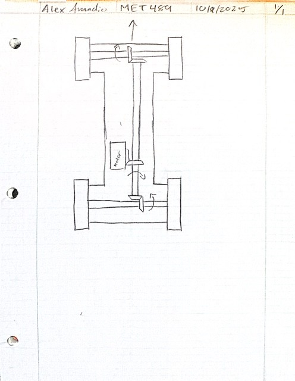

## Intro
This is a project done for the CWU ASME Baja R/C competition. This project addresses a need for a R/C car that is capable of completing a series of races with success. These races include the Slalom-and-sprint and the Baja competition. The car needs to be able to achieve a speed of 20 mph for success in the Slalom-and-sprint and have a chassis durable enough to be able to withstand the offroad track of the Baja Competition.

<figure style="flex:1 1 50%;margin:auto;">
    
    <figcaption>Figure 1: Initial sketch of Chassis and Drivetrain.</figcaption>
  </figure>

  <figure style="flex:1 1 45%;margin:0;">
    
    <figcaption>Figure 2: Alternate Design 1.</figcaption>
  </figure>
  <figure style="flex:1 1 45%;margin:0;">
    
    <figcaption>Figure 3: Alternate Design 2.</figcaption>
  </figure>

## Results

