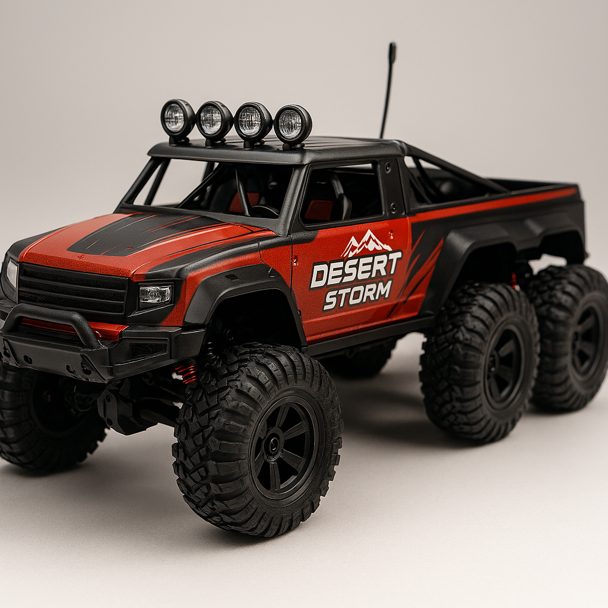

<!-- Home page: No main heading required per spec -->

## Intro

Welcome to my senior project site. This page will document the design, construction, and testing of my device over the course of the year. Posts below will describe progress and results.

  <figure style="flex:1 1 45%;margin:0;">
    
    <figcaption>Figure 1: Initial sketch of the device (replace with rendering and photo as project progresses).</figcaption>
  </figure>
  <figure style="flex:1 1 45%;margin:0;">
    
    <figcaption>Figure 2: Alternate view of the sketch (replace with rendering and photo as project progresses).</figcaption>
  </figure>

## Results

This section summarizes the key results. For now, it's a short placeholder — details will be added as experiments and analysis complete.

### Latest posts

<ul class="post-list">
  
    <li>
      <a href="{{ post.url | relative_url }}">{{ post.title }}</a> — <small>{{ post.date | date: "%B %-d, %Y" }}</small>
    </li>
  
</ul>
